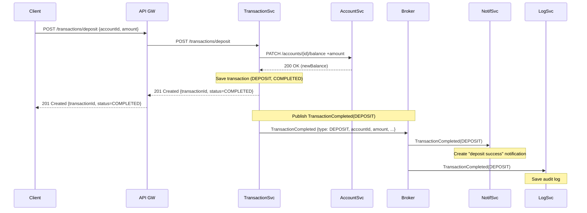

```mermaid
sequenceDiagram
    participant Client
    participant APIGW as API GW
    participant TransactionSvc as TransactionSvc
    participant AccountSvc as AccountSvc
    participant Broker as Broker
    participant NotifSvc as NotifSvc
    participant LogSvc as LogSvc

    Client->>APIGW: POST /transactions/deposit {accountId, amount}
    APIGW->>TransactionSvc: POST /transactions/deposit
    TransactionSvc->>AccountSvc: PATCH /accounts/{id}/balance +amount
    AccountSvc-->>TransactionSvc: 200 OK (newBalance)
    Note over TransactionSvc: Save transaction (DEPOSIT, COMPLETED)
    TransactionSvc-->>APIGW: 201 Created {transactionId, status=COMPLETED}
    APIGW-->>Client: 201 Created {transactionId, status=COMPLETED}
    
    Note over TransactionSvc, Broker: Publish TransactionCompleted(DEPOSIT)
    TransactionSvc->>Broker: TransactionCompleted {type: DEPOSIT, accountId, amount, ...}
    
    Broker->>NotifSvc: TransactionCompleted(DEPOSIT)
    Note over NotifSvc: Create "deposit success" notification
    
    Broker->>LogSvc: TransactionCompleted(DEPOSIT)
    Note over LogSvc: Save audit log
```
